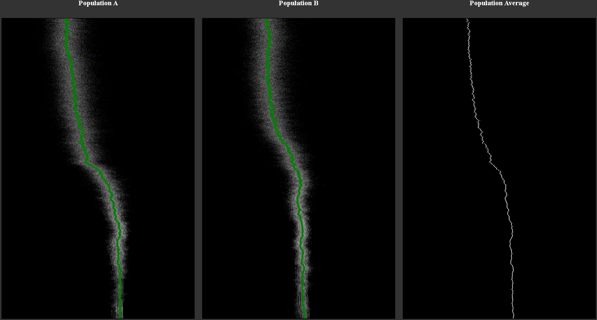

# Co-evolutionary Cellular Automata



**Turing-complete gladiators in the Game of Life.**

Explore a computational universe where two fields evolve together, shaping each other’s behavior in Conway’s Game of Life — a **Turing-complete** system capable of producing anything from logic gates to glider-based processors or even neural-like structures. This project uses a genetic algorithm to evolve the **initial states** of two fields, creating patterns that emerge not by design, but through co-evolutionary pressure.

## 🧬 Genetic Search in a Turing-Complete Universe

Conway’s Game of Life is more than a simulation — it’s a Turing-complete substrate where any computable process can theoretically emerge, given the right initial conditions. Finding those conditions in an infinite space of possibilities is the challenge. Here, we let a genetic algorithm navigate this space, evolving two fields that influence each other to produce dynamic, computational patterns. The result is an experiment in emergent complexity, where simple rules and co-evolution can lead to surprising outcomes.

## 🧠 How It Works

- **The Grid**: Two fields (A and B) form a combined toroidal grid, with A’s top edge adjacent to B’s bottom, and B’s top edge wrapping to A’s bottom, creating seamless boundary interactions.
- **The Rule**: A cellular automaton (default: Conway’s Game of Life, customizable) runs for a set number of steps.
- **Fitness**: Field A’s fitness is the number of cells in Field B that change (“flicker”) between the last two steps. Field B’s fitness is A’s flickering. This mutual dependency drives co-evolution.
- **Co-Evolution**: Two populations evolve in parallel. Each epoch, pairs of individuals (A[i], B[i]) are combined, evolved under the automaton, and scored based on their effect on each other.
- **Genetics**:
  - **Selection**: The top 50% of each population survives, preserving high-fitness patterns.
  - **Crossover**: Random cell mixing, with half the population kept as parents for stability.
  - **Mutation**: A low mutation rate (e.g., 1%, 1 cell flip) ensures gradual co-evolution, allowing fields to adapt to each other’s patterns slowly.
- **Visualization**: The `test100and101steps` function generates a PNG heat map showing flickering (white for changes, black for stable cells), highlighting boundary interactions.

## ⚔️ Co-evolution, Not Competition

Unlike traditional competition, this system has no fixed roles. Fields A and B co-evolve, each striving to maximize the other’s computational activity (flickering). They might:
- Develop patterns that destabilize the other, like glider streams crossing boundaries.
- Form symbiotic structures, such as oscillators that sustain mutual activity.
- Evolve computational systems, from logic gates to complex processors, as the Turing-complete substrate allows.

The toroidal boundaries ensure constant interaction, while the low mutation rate fosters a slow, adaptive “dance” where fields refine their influence over thousands of epochs.

## 📚 Related Project

This project is a **follow-up** to [Evolving Cellular Automata](https://github.com/xcontcom/evolving-cellular-automata), where the focus was on **evolving the rules** of cellular automata. In that earlier project, the 512-bit rule space defined the genotype, and fitness was tied to patterns produced after N iterations.

Here, we **fix the rule** (Conway’s Game of Life) and evolve the **initial field state** instead — flipping the genetic axis from **rule evolution** to **field evolution**.

## 📈 Observations

Experiments reveal diverse behaviors:
- Smaller grids (e.g., 55x55) may show fitness fluctuations after several hundred epochs, indicating dynamic shifts in co-evolution.
- Larger grids support more complex patterns but may stabilize without fluctuations, as patterns take longer to propagate.
- The number of iterations affects pattern reach—fewer iterations limit propagation in large grids, while more iterations allow deeper interactions.
- These outcomes depend on grid size, iterations, and mutation rate, making experimentation key.

## 📁 Repo Structure

```
📁 initial-state-evolution/
├── automata.html            # Single Conway's Game of Life automata for example
├── automata.js              # Logic for Conway's Game of Life (used in automata.html)
├── draw_node.js             # Main project file (entry point)
├── repl.js                  # Command-line REPL to launch cell functions
├── style.css                # Styles for testpop_from_file.html
├── testpop_from_file.html   # Client-side visualizer for 5 random automata
├── testpop_from_file.js     # JavaScript logic for client visualizer
├── visualize.html           # Heatmap viewer
├── storage/                 # Directory for saved .json population/fitness data
├── README.md                # Project overview and theory
```

## 🚀 Running the Simulation

```bash
node repl.js
```

Use this functions:

```js
module.exports = { evil, recreate, mutate, printBestGrid, restoreBestPopulations };

cell.recreate(); // New population
cell.evil(1000); // Run 1000 epochs
```

## 📜 License

MIT License. See [LICENSE](LICENSE) for details.

## 📬 Contact

**Serhii Herasymov**  
📧 sergeygerasimofff@gmail.com  
🌐 https://github.com/xcontcom


---

> Built not to model life as it is, but to search for what life *could be* — in Conway’s strange, silent universe.
